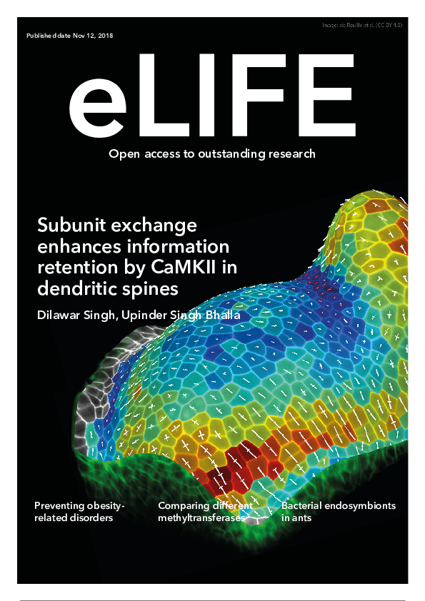

# Subunit exchange enhances information retention by CaMKII in dendritic spines

This repository contains model file, instructions to generate data, and some small 
data-set used in the following paper:

[__Subunit exchange enhances information retention by CaMKII in dendritic spines__](https://elifesciences.org/articles/41412) 
published in eLife (https://elifesciences.org/articles/41412).

# The model

The model is in `Python` which requires [https://moose.ncbs.res.in](pymoose) and
other python libraries: numpy, scipy, pandas, networkx. Except of `pymoose` and
`numpy` others library are optional but they are recommended especially for
analyzing and plotting data.

The model script is available in `./model` directory. See
[./model/README.md](model/README.md) for detailed instructions before you
continue. And for a sample output run with default parameters.

# Figures in the paper

Figures in the paper are generated by using `Tex/PGF` + `gnuplot`. I don't
recommend that you try to generate figures unless you are very comfortable
with TeX. However, raw experiments generates plots using `matplotlib`; some of
them are included in each folder for verification.

## Regenerating figures

Install `gnuplot` along with `texlive-2017`. If you are lucky, following will regenerate
the figure:

    $ cd ./PaperFigures
    $ make
    
All figures will be generated in `pdf` format.

# Generating raw data used in figures

Data used in paper is stored in folders which starts with `exp_`.
See `README.md` file in each of these folders for details. In most folders, we
do not include data when it is very large. For small data-set, however, I have
included the data along with the scripts.

# Development repository

This repository is skimmed version of
https://bitbucket.org/dilawar/camkii-pp1-system where model development took
place. This repository has full history of work but very unorganized. It not a recommended
source of this model. 

