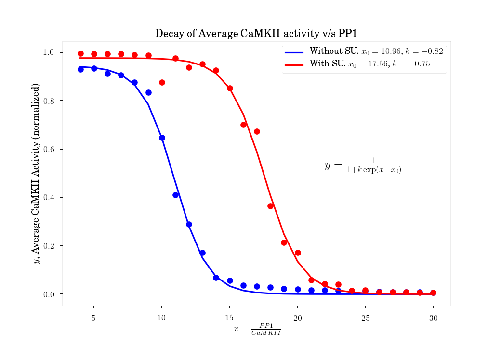

# Effect of subunit exchange on bistability

Run the following scripts to generate the data. 

   ./run_single_experiment.sh

This generates more than 2.5 GB of data and analyse it. Data generated is used
by figure 1 and figure 2 of paper. 

Here is an example figure.

We did not include any sample data for this experiment for its sheer size.
