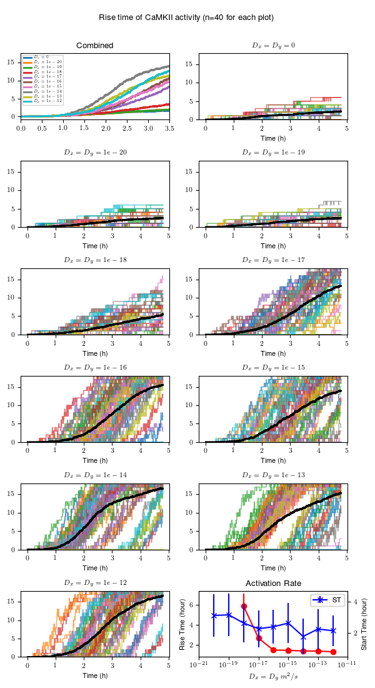
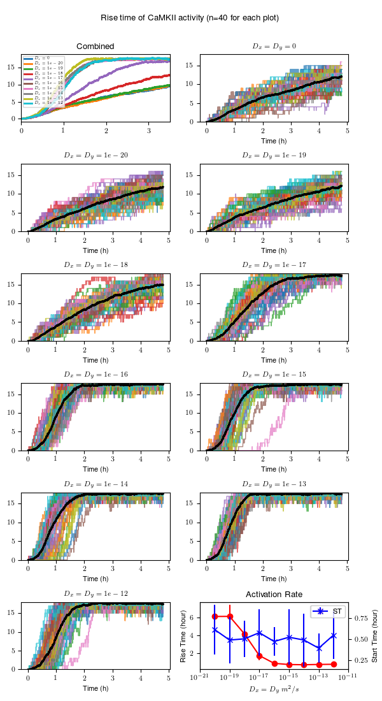

# Activation of CaMKII in presence of subunit exchange

**Figure 4**

To generate data 

    $ cmake .
    $ make -j4   # or as many processes as you like.

Here are some sample plots.

__NOTE__ By default, we generate data for 4 hours. To generate data to very long
time, one must have `RUN_TIME` option in `CMakeLists.txt` file and redo the
experiment.

