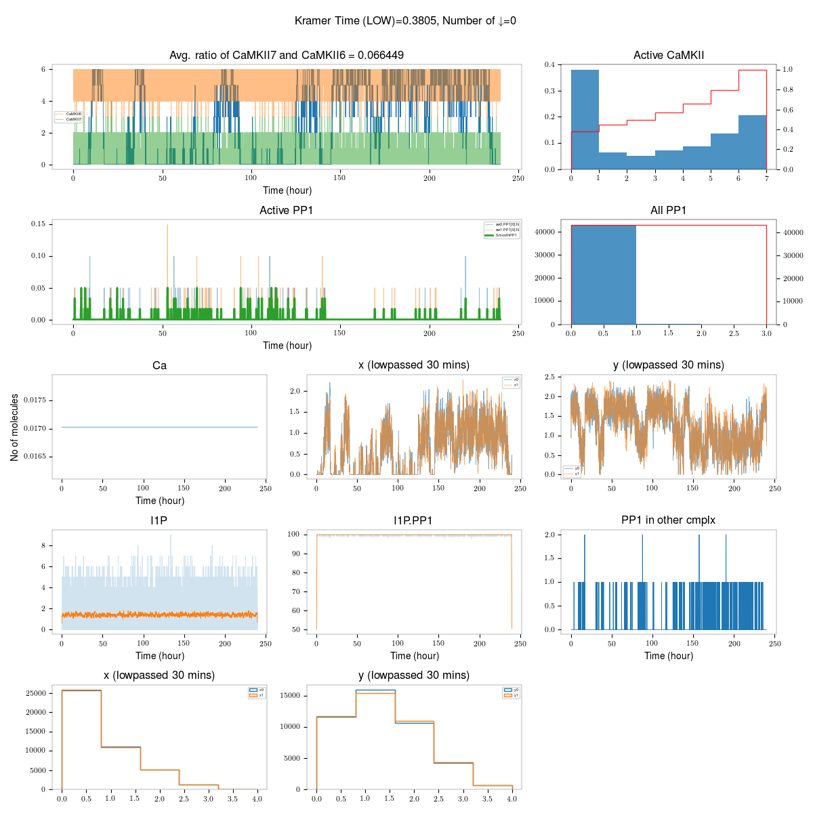

# Install dependencies

I suggest you use `python >= 3.6` . This model might also work with
`python-2.7`. 

First install required dependencies using pip.

    $ pip install -r requirements.txt --user

To test everything is fine, run the following script.

    $ ./run_bistable.sh 

This will run the pipeline and generate a `png` file and two data files.

# The model script

Model is named `./camkii_pp1_scheme.py` in all directories. This script accepts
parameters from command line. The default parameter are in `params.py` file.

The quick overview of options.

```
$ python ./camkii_pp1_scheme.py --help

usage: camkii_pp1_scheme.py [-h] [--simtime SIMTIME] [--outfile OUTFILE]
                            [--camkii CAMKII] [--pp1 PP1]
                            [--turnover-rate TURNOVER_RATE]
                            [--record-dt RECORD_DT]
                            [--enable-subunit-exchange]
                            [--num-switch NUM_SWITCH]
                            [--num-voxels NUM_VOXELS] [--diff-dict DIFF_DICT]
                            [--voxel-length VOXEL_LENGTH] [--ca-expr CA_EXPR]
                            [--michaelis-menten]

CaMKII/PP1 switch. Most parameters are in params.py file.

optional arguments:
  -h, --help            show this help message and exit
  --simtime SIMTIME, -st SIMTIME
                        Run time for simulation (days)
  --outfile OUTFILE, -o OUTFILE
                        Outfile to save the data in (csv) file.
  --camkii CAMKII, -ck CAMKII
                        No of CaMKII molecules in each voxel.
  --pp1 PP1, -pp PP1    No of PP1 molecules in each voxel.
  --turnover-rate TURNOVER_RATE, -tr TURNOVER_RATE
                        Turnover rate of CaMKKII (in per second)
  --record-dt RECORD_DT, -dt RECORD_DT
                        Record dt for plot
  --enable-subunit-exchange, -SE
                        Enable subunit exchange.
  --num-switch NUM_SWITCH, -ns NUM_SWITCH
                        No of switches in system
  --num-voxels NUM_VOXELS, -nv NUM_VOXELS
                        No of voxels in one switch.
  --diff-dict DIFF_DICT, -dd DIFF_DICT
                        Diffusion coefficients as python dictionary
  --voxel-length VOXEL_LENGTH, -nl VOXEL_LENGTH
                        Length of individial voxel
  --ca-expr CA_EXPR, -ca CA_EXPR
                        Calcium expression (muParser/moose expression)
  --michaelis-menten, -mm
                        Use Michealson-Menten scheme for dephosphorylated.

```

Run the model `./camkii_pp1_scheme.py`. It will generate a csv file containing all the data. 
I recommend to plot this data using `./analyze.py` file. This will generate
crude plots of the data, group the data and create another data file which is
easier to analyze.

# The plotting/analyze script

```
python ./analyze.py -h
usage: analyze.py [-h] --input INPUT [--output OUTPUT] [--debug DEBUG]
                  [--title TITLE]

Argument parser

optional arguments:
  -h, --help            show this help message and exit
  --input INPUT, -i INPUT
                        Input file
  --output OUTPUT, -o OUTPUT
                        Output file
  --debug DEBUG, -d DEBUG
                        Enable debug mode. Default 0, debug level
  --title TITLE, -title TITLE
                        Title of the plot
```

# Example run




Feel free to write to mailto@dilawars@ncbs.res.in in case you need help.  
